### 🚂 만든거

- [**📖 rrwg**][rrwg]: 영감이 필요할 때 보는 레어한 영어 단어
- [**😒 pickie**][pickie]: 성격 까다로운 인공지능 챗봇
- [**💠 dotdotfiles**][ddf]: 무식한 닷파일 매니저
- [**🗡️ kal**][kal]: 한국인을 위한 한국어 프로그래밍 언어
- [**🗃️ drop**][drop]: 컴퓨테이션에 관한 블로그
  - 대표글: [프로그래밍 언어 만들기][sa1] | [UTF 인코딩 구현하기][sa2] | [알고리즘이란 무엇인가][sa3] | [알고리즘 라이브러리 만들기][sa4]

### 🧪 성분

<a href="https://www.typescriptlang.org">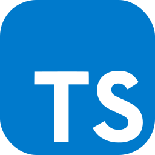</a><a href="https://www.python.org">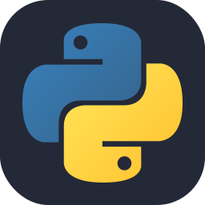</a><a href="https://www.java.com">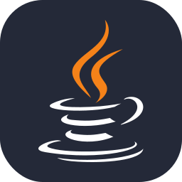</a><a href="https://www.haskell.org">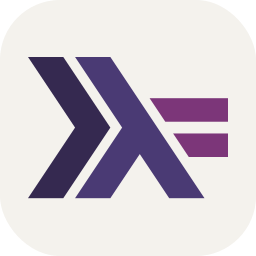</a><a href="https://www.rust-lang.org">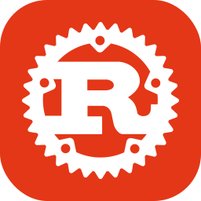</a><a href="https://www.lua.org">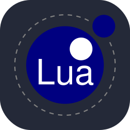</a><a href="https://www.latex-project.org">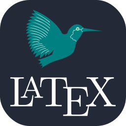</a><a href="https://nodejs.org">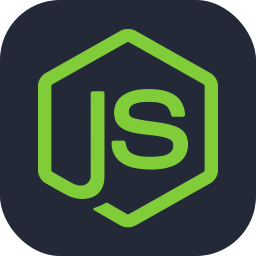</a><a href="https://expressjs.com">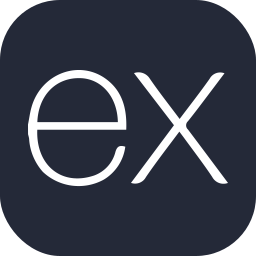</a><a href="https://tailwindcss.com">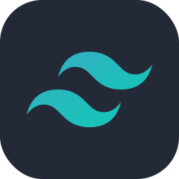</a><a href="https://astro.build">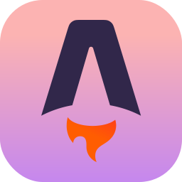</a><a href="https://github.com/features/actions">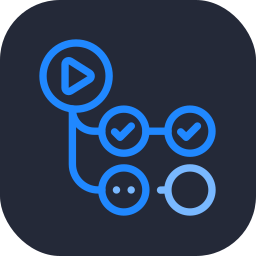</a><a href="https://neovim.io">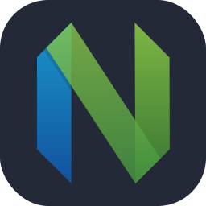</a><a href="https://www.google.com/search?client=safari&rls=en&q=arch+linux&ie=UTF-8&oe=UTF-8">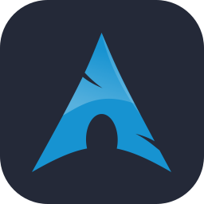</a>

[rrwg]: https://random-rare-word.netlify.app
[pickie]: https://pickie.streamlit.app
[ddf]: https://github.com/wcho21/dotdotfiles
[kal]: https://kal-playground.rooi.dev
[drop]: https://drop.rooi.dev
[sa1]: https://drop.rooi.dev/posts/2024/02/08/01/
[sa2]: https://drop.rooi.dev/posts/2023/06/10/01/
[sa3]: https://drop.rooi.dev/posts/2024/05/07/01/
[sa4]: https://drop.rooi.dev/posts/2024/05/09/01/